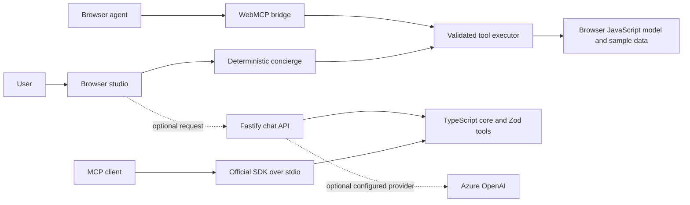

# Agent Name
Campus Twin Concierge

## Team Details
Complete this section if the agent is nominated by a team.

- Team Name: Not provided
- Team Members: Not provided
- Primary Contact: Not provided
- Business / Technical Area: Workplace wayfinding and agentic AI

## 1. Problem Statement
Employees, visitors, and facilities teams need a clear way to find rooms and services in a multi-floor office. Room directories and static maps make it difficult to ask questions naturally, plan a multi-stop visit, or see how an agent uses tools and workflows. The current building layout in this project is illustrative sample data, not a verified Sopra Steria floor plan.

## 2. Proposed Agent
Campus Twin Concierge is a workplace wayfinding agent connected to a 2D/3D building model. A user can ask for a room, route, facility, meeting space, or predefined journey. The implemented local agent is deterministic and runs without credentials; it calls validated tools and can present map actions in the studio. A separate Fastify API offers the same deterministic fallback and optional server-side Azure OpenAI tool calling when approved credentials are configured; no AI key is needed for the demo.

## 3. Key Capabilities
- Search rooms by name, type, and tags, then provide floor-aware directions.
- Find nearby facilities, suitable meeting rooms, and multi-stop workflows.
- Show an indicative emergency route to stairs without routing through lifts; this is not certified evacuation guidance.
- Inspect sample layout quality and space metrics through reusable agent tools.
- Demonstrate tool calls and workflow steps in a visible trace.

## 4. Target Users
Office employees, visitors, reception and facilities teams, and developers learning how agents, tools, and workflows fit together.

## 5. How It Works
The local concierge classifies the request, selects a tool sequence, validates each tool input, and executes it against the building model. The studio can apply presentation actions such as selecting a room or drawing a route. It tries the optional API first and falls back to its local agent if the API is unavailable. Browser agents can use the WebMCP bridge where supported. IDE clients can use the official SDK-backed stdio MCP server, which exposes the TypeScript core's headless tools but does not control an open browser tab. The browser still uses its JavaScript runtime during migration. Responses include a concise result and tool trace.

## 6. Technology / Framework
Current implementation: Node.js 22 ESM, Vite, browser JavaScript, HTML/CSS, Three.js, Fastify, Node's built-in test runner, a strict TypeScript core with Zod v4, and the official MCP SDK over stdio. The browser UI/runtime still use JavaScript during migration. Azure OpenAI integration is implemented as optional server-side configuration; no external LLM service is connected by default.

## 7. Tools / Integrations
The local tool catalog covers inspection, room search, wayfinding, workflows, layout validation, metrics, and browser presentation. Current integrations are the optional Fastify chat API, browser WebMCP bridge, and SDK-backed stdio MCP server, which exposes headless tools from the TypeScript core. Azure OpenAI is optional, not connected by default. No live occupancy service, identity provider, or verified floor-plan source is connected.

## 8. Expected Business Value
The agent is intended to reduce manual room-finding effort, make visitor journeys easier to explain, and provide a reusable example of agent/tool/workflow concepts. Benefits have not been measured; no time or cost savings are claimed.

## 9. Innovation / Differentiator
The TypeScript MCP server and its tests share one Zod-validated tool catalog and building model, with execution attributed to the caller. The existing browser still has a parallel JavaScript runtime during migration. The offline deterministic agent makes the experience demonstrable without API keys, while MCP and WebMCP illustrate reuse across IDE and browser-agent surfaces.

## 10. Architecture / Flow Diagram
See [docs/architecture.md](docs/architecture.md) for the implemented and planned architecture.

## 11. Effort Spent in Hrs
To be completed by the submitting representative. Development hours are not currently tracked.

## 12. Expected Output
A room or facility answer with floor information, indicative route steps, and an optional route or room selection in the studio. Inspection and workflow requests return structured summaries and a trace of the tools used. A stdio MCP client receives structured, headless tool results; it does not automatically update the studio UI. Example: `get_directions` to `3-it` returns a sample Reception-to-IT Helpdesk route via lift. See [README.md](README.md#five-minute-demo) for the live demo and annotated screenshots.

## 13. Data / Security Considerations
The included layout is synthetic sample data and must not be used for operational navigation or emergency response. Do not add personal data, access credentials, or real security-sensitive floor plans without authorization. The browser agent and MCP server require no secrets. Optional Azure credentials must remain server-side and use approved identity/configuration; never commit or upload secrets. Production authentication/authorization is not implemented. Tool inputs are validated and unknown internal errors are masked by the executor.