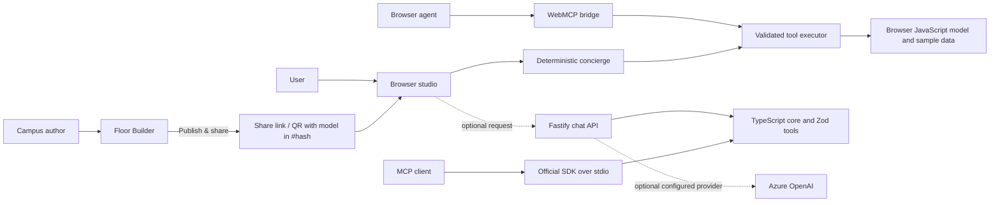

# Agent Name
Campus Twin Concierge

## Team Details
Complete this section if the agent is nominated by a team.

- Team Name: Not provided
- Team Members: Not provided
- Primary Contact: Not provided
- Business / Technical Area: Workplace wayfinding and agentic AI

## 1. Problem Statement
As a fresher, finding my way around a large campus was hard. With towers of 10, 17 or 19 floors, everyday questions meant walking and asking around: where is the stationery counter, which floor has the medical room, where is the lab I need for testing, which lift goes there? Printed floor maps were outdated or missing, and every new joiner had to learn the same routes the hard way. Employees, visitors and facilities teams face the same problem, and room directories or static maps do not let them ask naturally or plan a multi-stop visit. The building layout in this project is illustrative sample data, not a verified Sopra Steria floor plan.

## 2. Proposed Agent
Campus Twin Concierge is a workplace wayfinding agent connected to a 2D/3D building model. Anyone can **build** a campus floor by floor in the Floor Builder, **publish** it as a share link and QR code, and let others **navigate** it in 3D. A user can ask for a room, route, facility, meeting space, or predefined journey. The implemented local agent is deterministic and runs without credentials; it calls validated tools and can present map actions in the studio. A separate Fastify API offers the same deterministic fallback and optional server-side Azure OpenAI tool calling when approved credentials are configured; no AI key is needed for the demo.

## 3. Key Capabilities
- Build a campus model floor by floor (rooms, labs, medical room, stationery, pantries, lifts, stairs) in the Floor Builder.
- Publish the model as a share link and QR code that opens a read-only 3D copy on any device, with no server upload.
- Search rooms by name, type, and tags, then provide floor-aware directions.
- Find nearby facilities, suitable meeting rooms, and multi-stop workflows.
- Show an indicative emergency route to stairs without routing through lifts; this is not certified evacuation guidance.
- Inspect sample layout quality and space metrics through reusable agent tools.
- Demonstrate tool calls and workflow steps in a visible trace.

## 4. Target Users
Freshers and new joiners, office employees, visitors, reception and facilities teams who publish the campus model, and developers learning how agents, tools, and workflows fit together.

## 5. How It Works
A facilities or team member builds the campus in the Floor Builder and clicks **Publish & share**; the model is validated, compressed and placed in the link after `#model=`. Anyone who opens the link or scans the QR code gets the same building in the studio. The local concierge classifies the request, selects a tool sequence, validates each tool input, and executes it against the building model. The studio can apply presentation actions such as selecting a room or drawing a route. It tries the optional API first and falls back to its local agent if the API is unavailable. Browser agents can use the WebMCP bridge where supported. IDE clients can use the official SDK-backed stdio MCP server, which exposes the TypeScript core's headless tools but does not control an open browser tab. The browser still uses its JavaScript runtime during migration. Responses include a concise result and tool trace.

## 6. Technology / Framework
Current implementation: Node.js 22 ESM, Vite, browser JavaScript, HTML/CSS, Three.js, Fastify, Node's built-in test runner, a strict TypeScript core with Zod v4, and the official MCP SDK over stdio. The browser UI/runtime still use JavaScript during migration. Azure OpenAI integration is implemented as optional server-side configuration; no external LLM service is connected by default.

## 7. Tools / Integrations
The local tool catalog covers inspection, room search, wayfinding, workflows, layout validation, metrics, and browser presentation. Current integrations are the optional Fastify chat API, browser WebMCP bridge, and SDK-backed stdio and stateless HTTP MCP transports. The Floor Builder supports local draft editing, deterministic command chat, JSON import/export, and publishing a share link/QR code; headless MCP tools accept and return drafts without writing to a browser tab. Azure OpenAI is optional, not connected by default. No live occupancy service, identity provider, or verified floor-plan source is connected.

## 8. Expected Business Value
The agent is intended to reduce manual room-finding effort for new joiners, let any team publish and update its own campus map without design tools or hosting a database, make visitor journeys easier to explain, and provide a reusable example of agent/tool/workflow concepts. Benefits have not been measured; no time or cost savings are claimed.

## 9. Innovation / Differentiator
The TypeScript MCP server and its tests share one Zod-validated tool catalog and building model, with execution attributed to the caller. The existing browser still has a parallel JavaScript runtime during migration. Campus models are user-built and shared as self-contained links, so a 3D twin can be published without a backend. The offline deterministic agent makes the experience demonstrable without API keys, while MCP and WebMCP illustrate reuse across IDE and browser-agent surfaces.

## 10. Architecture / Flow Diagram
See [docs/architecture.md](docs/architecture.md) for the implemented and planned architecture.

## 11. Effort Spent in Hrs
To be completed by the submitting representative. Development hours are not currently tracked.

## 12. Expected Output
A published share link and QR code for a user-built campus model, which opens the building in 3D for anyone with the link. A room or facility answer with floor information, indicative route steps, and an optional route or room selection in the studio. Inspection and workflow requests return structured summaries and a trace of the tools used. A stdio MCP client receives structured, headless tool results; it does not automatically update the studio UI. Example: `get_directions` to `3-it` returns a sample Reception-to-IT Helpdesk route via lift. See [README.md](README.md#five-minute-demo) for the live demo and annotated screenshots.

## 13. Data / Security Considerations
The included layout is synthetic sample data and must not be used for operational navigation or emergency response. Do not add personal data, access credentials, or real security-sensitive floor plans without authorization. The browser agent and MCP server require no secrets. Optional Azure credentials must remain server-side and use approved identity/configuration; never commit or upload secrets. Production authentication/authorization is not implemented. Tool inputs are validated and unknown internal errors are masked by the executor. Published links carry the full layout, so anyone with a link can see it; share links for real buildings only with authorized people. Incoming links are size-limited, validated, and stripped of unknown fields before the model is loaded. Why there is no database or user store yet, and the proposed design, are in [section 16](#16-data-storage-users-and-identity).

## 14. Feature Inventory
Everything below is implemented in this repository unless marked *planned*.

**Landing page** (`index.html`)
- Product overview with entry points to the Studio, Floor Builder and Studio QR page.
- "Ask Campus Twin" card that deep-links a question into the Studio (`?ask=`).

**Studio – navigate a building** (`studio.html`)
- 3D orbit view (Three.js), 2D floor plan and first-person walk view; keys `1`/`2`/`3` switch views.
- Floor list and floor stack to switch floors; all-floors overview in 3D.
- Room search (`/` to focus) by name, type and tags; facility filters for Restroom, Pantry, Cafeteria and First Aid.
- Room details panel with type, floor, hours, capacity, notes and nearby spaces.
- "You are here" location, indicative routes across floors via lift or stairs, with distance, time and steps.
- Emergency mode: indicative route to the nearest stairs, never via lifts, with a non-certification notice.
- Predefined workflows such as the new-joiner Day 1 journey, shown as a multi-stop itinerary.
- Layout checks (overlaps, rooms outside the footprint, missing exits/lifts/restrooms/first aid) and space metrics.
- Activity tab showing every tool call by the human or the agent.
- Deep links: `?room=`, `?here=`, `?floor=`, `?view=`, `?workflow=`, `?ask=`; Share button copies a room link.
- Studio QR on screen and a printable QR page (`qr.html`).
- Resizable sidebars, responsive tablet/phone layout with Map, Rooms, Studio QR and More tabs.

**Concierge agent**
- Deterministic offline agent that understands help, navigate, nearest facility, meeting room, floor listing, set location, workflow, emergency, layout check, metrics, overview, switch view and clear requests.
- Optional Fastify API (`/api/agent/chat`) with the same deterministic fallback and optional Azure OpenAI tool calling.
- The browser tries the API first and falls back to the local agent.

**Floor Builder – build a campus** (`builder.html`)
- Add, rename, delete floors and set short codes; set building width/depth and mark dimensions as estimated or measured with a source note.
- Add spaces of 15 types (reception, security, lounge, cafeteria, pantry, workspace, meeting, training, restrooms, lifts, stairs/fire exit, first aid, office, wellness, other). Labs or a stationery counter are added as named "other" areas today.
- Place, drag, move, resize, rename, retype, duplicate and delete spaces; overlap and footprint checks on every move.
- Right-click menu on the plan, zoom controls, draggable/dockable panels.
- Builder chat with offline commands, e.g. `add a 6 by 4 meeting room called Orion on floor 2`.
- Draft autosaves in the browser; Download JSON / Import JSON; Reset to the sample.

**Publish & share**
- **Publish & share** creates a link and QR code with the model compressed after `#model=`; Copy, native Share and Open 3D view.
- Opening the link loads a read-only 3D copy in the Studio; **Edit a copy** loads it into the viewer's own builder after confirmation.

**Agent integrations**
- Stdio MCP server (official SDK) and stateless HTTP MCP endpoint (`/api/mcp`) with headless tools.
- MCP builder tools `get_building_template` and `edit_building_draft` for agent-driven building edits.
- Browser WebMCP bridge exposing Studio tools and builder tools (`builder_get_draft`, `builder_edit`, `builder_add_floor`, `builder_add_room`, `builder_move_room`) where the browser supports `navigator.modelContext`.

**Security already in place**
- Strict Content-Security-Policy (no inline scripts), `X-Frame-Options: DENY`, `nosniff`, restrictive Permissions-Policy on the static server.
- API: Helmet headers, 32 KB body limit, 60 requests/min rate limit, input length and ID pattern checks.
- All tool inputs validated against schemas; untrusted text rendered as text, never HTML.

## 15. Agent Instructions
These are the operating instructions for any agent (local concierge, Azure OpenAI, MCP or WebMCP client) working with Campus Twin.

**Role.** You are the Campus Twin workplace concierge. Help people find rooms and facilities, plan routes and journeys, and help authors build and publish a campus model.

**Rules**
1. Use tools for every building fact. Never invent rooms, floors, hours, availability or people.
2. State that the layout is illustrative sample data unless the building is marked as measured and approved.
3. Emergency routes are indicative only. Always tell the user to follow on-site wardens and signage, and never route through lifts.
4. Prefer read-only tools. Call presentation tools (focus, navigate, show) only when the user wants to see the result on the map.
5. Validate inputs before calling a tool; use room IDs returned by `search_rooms` or `list_rooms`, not guessed IDs.
6. Use at most 6 tool calls per request. If a tool cannot find something, say so and suggest a search.
7. Do not collect or reveal personal data, credentials or real security-sensitive layouts.
8. Refuse requests outside workplace navigation and building authoring.

**Response format.** One short answer sentence naming the room and floor, then numbered route steps when relevant, then up to three follow-up suggestions. The tool trace is shown separately.

**Tool catalog**

| Tool | Type | Use it to |
| --- | --- | --- |
| `get_building_overview` | read | Summarize floors, room counts and facilities |
| `list_rooms` | read | List rooms, optionally by floor or type |
| `get_room` | read | Get one room's details |
| `search_rooms` | read | Find rooms by name, type or tag |
| `find_nearest` | read | Find the nearest facility of a type from a room |
| `find_meeting_room` | read | Suggest a meeting room by size/floor |
| `get_directions` | read | Route between two rooms across floors |
| `get_emergency_exit` | read | Indicative route to the nearest stairs |
| `list_workflows` | read | List predefined journeys |
| `plan_itinerary` | read | Order stops for a multi-stop journey |
| `set_my_location` | session | Set "you are here" |
| `validate_layout` | read | Run layout checks |
| `get_space_metrics` | read | Area and space-mix metrics |
| `get_view_state` | presentation | Read the current map view |
| `switch_view` | presentation | Switch 3D / 2D / walk |
| `set_active_floor` | presentation | Show a floor |
| `focus_room` | presentation | Select and fly to a room |
| `navigate_to` | presentation | Draw a route on the map |
| `show_emergency_exit` | presentation | Draw the emergency route |
| `show_itinerary` | presentation | Draw a workflow journey |
| `clear_map` | presentation | Clear selection and routes |
| `get_building_template` | builder (MCP) | Get a starting building draft |
| `edit_building_draft` | builder (MCP) | Apply one edit and return the new draft |

**Builder agent instructions.** Start from `get_building_template` or the current draft (`builder_get_draft`). Apply one edit at a time and pass the returned draft into the next edit. Keep rooms inside the footprint and avoid overlaps. Give every floor at least two stairs, a lift, restrooms and first aid, then run `validate_layout`. Mark dimensions as estimated unless the author provides a measured source. Ask the author to publish from the Floor Builder; agents do not publish on their own.

**Example prompts:** "Where is the medical room?", "Take me to Meeting Room 3.01", "Nearest pantry from here", "It's my first day", "Show the emergency exit", "Add a 6 by 4 test lab called Lab A on floor 2".

## 16. Data Storage, Users and Identity
**Why there is no database or user store today**
- **Scope:** this is an Agentathon prototype. The goal is to prove build → publish → navigate and the agent/tool design, not to run a production service.
- **No approved data:** the building is illustrative sample data. Storing real floor plans needs facilities and security approval first.
- **Privacy by default:** without production sign-in, storing user accounts, locations or search history would create personal data with no proper protection. Under GDPR and India's DPDP Act 2023, not collecting it is the safest option.
- **No secrets in the submission:** a database needs connection strings and credentials, which must not be uploaded to SharePoint.
- **Zero-ops demo:** drafts live in the browser, published models live inside the link, and the site can be served from any static host. Anyone can run it with `npm start`.

**Proposed production design** *(planned, not implemented)*

| Concern | Proposal |
| --- | --- |
| Sign-in | Microsoft Entra ID single sign-on (OpenID Connect via MSAL). The app never stores passwords. |
| Users | Store only the Entra object ID, display name, email and role. No location history. |
| Roles | **Visitor** (no login, read-only published views via QR), **Employee** (view and navigate), **Campus Editor** (build and publish), **Facilities Admin** (approve, revoke links, manage editors). Enforced on the server from Entra app roles. |
| Database | Azure Database for PostgreSQL (Flexible Server); building models in `JSONB`, validated with the existing Zod schemas. Schema migrations with Drizzle or Prisma. |
| Files | Azure Blob Storage for uploaded floor-plan images and exports. |
| Secrets | Azure Key Vault and Managed Identity; no connection strings in code or config files. |
| Hosting | Azure App Service or Container Apps for the API; static web on Azure Static Web Apps or the approved host. |
| Audit | Append-only audit log for create, edit, publish and revoke actions. |

**Proposed tables**

| Table | Key columns |
| --- | --- |
| `users` | `id`, `entra_oid` (unique), `display_name`, `email`, `role`, `created_at` |
| `campuses` | `id`, `name`, `city`, `owner_id` |
| `buildings` | `id`, `campus_id`, `name`, `created_by` |
| `building_versions` | `id`, `building_id`, `version`, `model` (JSONB), `status` (draft/approved/published), `dimension_basis`, `created_by`, `approved_by`, `created_at` |
| `share_links` | `id`, `slug`, `building_version_id`, `visibility` (internal/public), `expires_at`, `revoked_at`, `created_by` |
| `audit_log` | `id`, `actor_id`, `action`, `target_type`, `target_id`, `at` |

**Proposed API additions**
- `GET /api/buildings/:id/published` – latest published version (employees; public only if the link is public).
- `POST /api/buildings/:id/versions` – save a draft version (Campus Editor).
- `POST /api/buildings/:id/publish` – approve and publish a version, creating a short link (Facilities Admin or approved Editor).
- `DELETE /api/share-links/:slug` – revoke a link.
- `GET /s/:slug` – resolve a short, revocable link to the Studio.

**Migration path**
1. Add Entra ID sign-in to the API and Floor Builder; keep the Studio open for published views.
2. Save drafts and versions to PostgreSQL; keep JSON import/export.
3. Replace `#model=` links with short `/s/:slug` links that can expire and be revoked; keep hash links for offline demos.
4. Add approval before publishing real buildings, and review data with facilities and security.
5. Keep "you are here" on the device. Add people-aware or occupancy features only with consent and a privacy review.