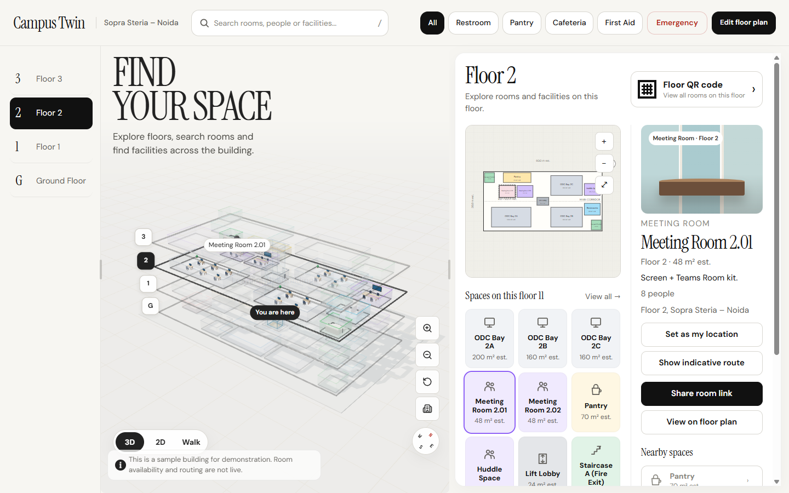
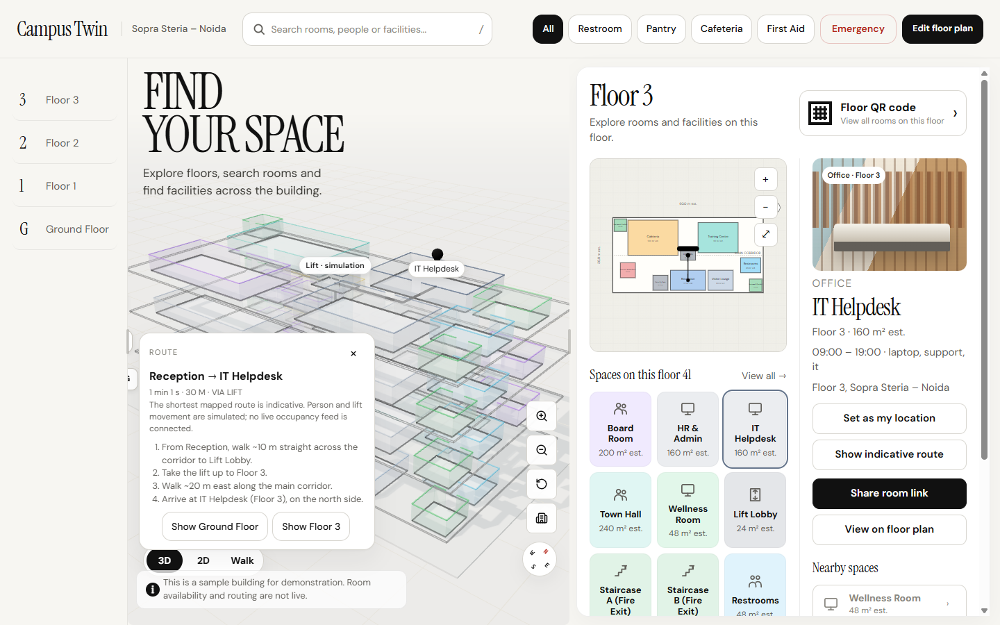
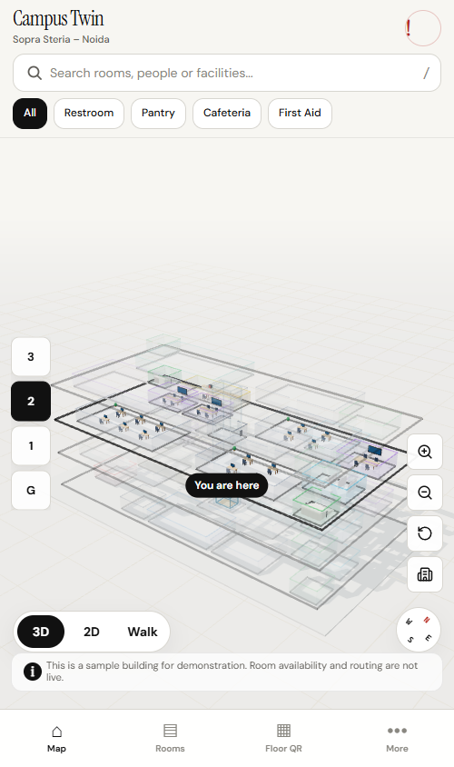

# Campus Twin Concierge

Campus Twin is a human-and-agent workplace wayfinding prototype. The studio combines a building directory, 2D/3D views, a deterministic offline concierge, reusable tools, workflows, and MCP/WebMCP prototypes. The included Noida layout is explicitly illustrative sample data and is not a verified floor plan.

## Status
The browser studio is bundled with Vite and still uses its JavaScript runtime. A parallel strict TypeScript core powers the stdio MCP server and a Fastify chat API with deterministic fallback and optional Azure OpenAI integration. Browser presentation and MCP tools are separate: an MCP call does not move the map in an open browser tab. The browser does not yet share the TypeScript core, and production authentication, approved building data, and deployment are not implemented. See [docs/architecture.md](docs/architecture.md) for the current boundary.

## Prerequisites
- Node.js 22 or newer
- npm (included with Node.js)
- A modern browser for the studio

No AI API key is needed for the browser concierge, the local MCP server, or the API's deterministic fallback. Azure OpenAI is optional and requires approved server-side configuration; never place a key in browser code or the submission.

## Install and Run
From the project root:

```powershell
npm install
npm start
```

Open the studio at `http://127.0.0.1:5173/studio.html` (or the port Vite prints if 5173 is busy). Keep the terminal running. The app works without an API server: if the local chat endpoint is unavailable, it uses the deterministic browser concierge. This is a local demo, not a public URL.

### Floor Builder
Open `http://127.0.0.1:5173/builder.html` to edit a browser-local draft. Right-click empty floor space to add a room, lift, stairs, or floor; right-click a room to select, move, duplicate, or delete it. Drag a room on the plan to reposition it. On wide screens, drag the side panels by their move handles; double-click a handle to dock it again. **Builder chat** accepts specific offline commands such as `add floor called Showcase`, `add a 6 by 4 meeting room called Orion on floor 2`, `move Orion to 12, -5`, and `rename room Orion to Atlas`. Unsupported instructions report an error; this chat is not an LLM. Download JSON to back up your draft, or Import JSON to load a valid building draft into this browser. Draft changes are stored only in this browser until exported.

## Five-Minute Demo
Use a desktop browser for the presentation; the layout also supports tablet and phone screens.

1. Open the studio and select Floor 2. Show the 3D model, rotate it, drag the sidebar dividers, then switch to **2D** to inspect the plan.
2. Type `Where is the IT helpdesk?` in search and press Enter. The local concierge finds the room, draws an indicative route from Reception, and lists steps including the lift to Floor 3. The result is generated from sample geometry, not live building data.
3. Open **Ask the building** in the details panel to show the tool trace. Explain: an **agent** chooses and calls a **tool** (such as directions); a **workflow** links several steps, such as the predefined new-joiner journey.
4. Under **Ask the building**, try a predefined workflow or open **Checks** and run the layout checks. On mobile, use **Rooms**, **Floor QR**, and **More** in the bottom navigation to show those separate screens.
5. For the optional MCP portion, use an MCP-capable client configured as below. Its headless `get_directions` call returns route data; it does **not** change the map in an already open browser tab.

### Screenshots
These are local captures of the illustrative demo, saved under [docs/screenshots](docs/screenshots). They are not verified floor plans or live occupancy data.

**Desktop studio:** Floors, 3D overview, room directory, and room details. The sidebars can be resized by dragging their dividers.



**Wayfinding example:** The browser concierge's indicative route from Reception to IT Helpdesk on Floor 3. The route card lists the lift and walking steps; this is a browser interaction, not an MCP screenshot.



**Narrow-screen layout:** Floor selector, 3D map, view switch, compass and bottom navigation shown at a 500px viewport. On a real phone the controls reflow to its available width.



## Configuration
The browser and MCP demos require no environment variables. The optional API runs in deterministic mode with no credentials. To use Azure OpenAI instead, configure `AZURE_OPENAI_ENDPOINT`, `AZURE_OPENAI_API_KEY`, and `AZURE_OPENAI_DEPLOYMENT` together on the **server**; `AZURE_OPENAI_API_VERSION` is optional. Never put secrets in browser code, screenshots, commits, or the SharePoint submission. No key is needed to demonstrate the agent/tool/workflow concepts.

## Agent and MCP
The built-in concierge runs locally and deterministically. Example input: `Where is the IT helpdesk?` Expected output: a result naming the IT Helpdesk and its floor, a visible tool trace, and a route presentation in the studio when presentation tools are available.

To run the optional local Fastify API alongside Vite, open a second terminal and run `npm run api`. Vite proxies `/api` to port 3000. Without Azure configuration the API uses the deterministic agent; the browser still falls back to its own local agent if the API is stopped. The API is not required for the demo.

The stdio MCP server uses the official SDK and exposes headless tools only. Start it from an MCP-capable host with `npm run mcp` (this builds the TypeScript core/server first), or configure the client to run `node` with `src/apps/mcp-server/main.mjs` after `npm run build:mcp`. For example, in VS Code's workspace MCP configuration, register a stdio server:

```json
{
	"servers": {
		"campus-twin": {
			"type": "stdio",
			"command": "node",
			"args": ["${workspaceFolder}/src/apps/mcp-server/main.mjs"]
		}
	}
}
```

Ask the MCP client to call `get_directions` with `{ "toRoomId": "3-it" }`. Sample structured output includes `from: Reception`, `to: IT Helpdesk`, `via: lift`, `distanceM: 30`, `etaSeconds: 61`, and route steps. The browser WebMCP bridge is different: it registers browser tools only if the browser provides `navigator.modelContext`.

For a building-editing client, call `get_building_template`, then `edit_building_draft` with `{ "building": <template building>, "action": "add_room", "level": 2, "name": "Orion", "category": "meeting", "width": 6, "depth": 4 }`. Pass the returned `structuredContent.building` into subsequent edits; supported actions include naming/resizing the building, adding/renaming/deleting floors, and adding/moving/resizing/renaming/deleting/duplicating/retyping rooms. Export the final building JSON and use **Import JSON** in Floor Builder. The MCP endpoint at `/api/mcp` and the stdio server are stateless: they return updated drafts but cannot directly change an open browser tab. Browser WebMCP also exposes `builder_get_draft`, `builder_edit`, `builder_add_floor`, `builder_add_room`, and `builder_move_room` for compatible in-page agents; these tools act on browser-local state only.

## Tests
```powershell
npm test
npm run test:unit
npm run test:integration
```

`npm test` builds the core, MCP server, API, and Vite studio before running the Node test suite. Tests cover the compiled core, API, SDK MCP server over in-memory and stdio transports, and static browser server.

## Limitations
- Building geometry and room details are sample data and have not been checked against actual site plans.
- The lift preview uses a reference photograph of another building, not the Noida site. [Elevator Lobby, Renaissance Center](https://commons.wikimedia.org/wiki/File:Elevator_Lobby,_Renaissance_Center,_Jefferson_Avenue,_Detroit,_MI.jpg) by w_lemay is licensed under [CC BY-SA 2.0](https://creativecommons.org/licenses/by-sa/2.0/); the image is resized for the preview.
- Route distances, times, and layout checks are indicative and are not building-code, accessibility, or life-safety certification.
- No live occupancy, room booking, identity, or facilities system is connected.
- Azure OpenAI support in the API is optional, not required or connected by default. Production authentication and deployment are not implemented.
- The Vite studio still uses a parallel JavaScript runtime; it does not yet share the TypeScript core with the MCP server and API.

## Deployment
For a local demonstration, use `npm start`. A build for an approved static host can be produced with `npm run build:web` (output: `dist/web`), but publishing this sample app requires organizational approval. The local static server (`npm run serve`) and the development server are not production services. Do not expose the API or an MCP endpoint publicly without authentication, approved hosting, authorized building data, and a security review.

## Agentathon Submission
The project root contains `Agent.md`, `README.md`, `src/`, `tests/`, and `docs/` (including screenshots). Submit **one** copy in the assigned SharePoint folder of the primary contact. Do not rename or restructure the SharePoint-assigned folder. The representative must verify the required `<Firstname>_<Lastname>_<EmpID>` naming convention and fill in real team/contact details and actual effort hours in [Agent.md](Agent.md); none are invented here. Remove any unauthorized or sensitive material before uploading. The stated submission deadline is Monday, 05 October 2026; confirm access and timing with the organizers.