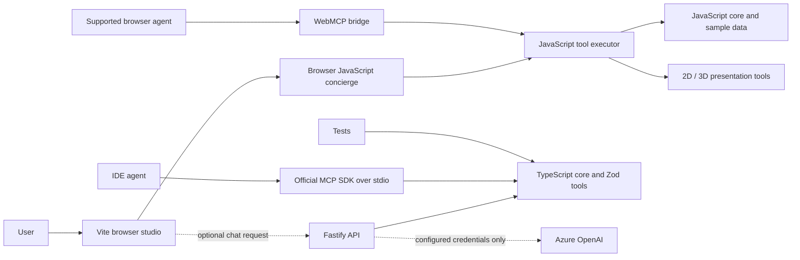
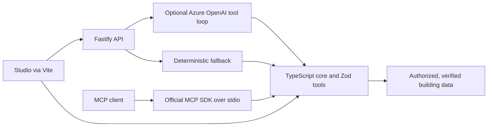

# Architecture and Migration Status

## Current Implementation
The browser studio and Floor Builder are Vite-bundled HTML/CSS/ES modules under `src/web` and continue to use a JavaScript runtime, deterministic concierge, presentation tools, and optional WebMCP bridge. The TypeScript MCP server under `src/apps/mcp-server` uses the official SDK and compiled core, exposing headless tools over stdio and a stateless Streamable HTTP endpoint at `/api/mcp`. A Fastify API under `src/apps/api` offers a deterministic chat fallback and optional Azure OpenAI tool calling; the browser falls back to its local agent if the API is unavailable. Floor Builder stores drafts in browser localStorage; MCP draft-edit calls accept and return complete building JSON and never mutate browser storage.

The strict TypeScript workspace at `src/packages/core` now contains geometry, the building model, search, wayfinding, validation, metrics, Zod tool schemas/executor, runtime, and the deterministic concierge. Unit tests exercise the compiled package. The browser still uses a parallel JavaScript implementation, so TypeScript is not yet the application's sole source of truth.

## Planned Architecture
The migration target keeps the studio interface while making the strict TypeScript core the shared source for browser and server callers. Zod v4 definitions remain the runtime validation and JSON-Schema source. The existing Fastify API already owns optional Azure OpenAI calls and server-side configuration, with a deterministic fallback; Vite already bundles the current UI and local Three.js dependencies. Production identity, approved data, hosting, and security review remain future work.

## Trust and Data Boundaries
- Tool calls are validated at the executor boundary and attributed to the caller.
- MCP supports local stdio and a stateless HTTP endpoint at `/api/mcp`; the latter has no production authentication and must not be exposed publicly as-is. Browser WebMCP acts only in the browser that hosts it.
- Azure configuration is optional and server-side. No secret belongs in this repository or browser bundle; neither the development API nor MCP stdio server has production authorization controls.
- The included building data is synthetic. Operational use requires authorized, verified plans and review by facilities/safety stakeholders.
- Emergency route output is a prototype indication only; follow official site procedures and signage.