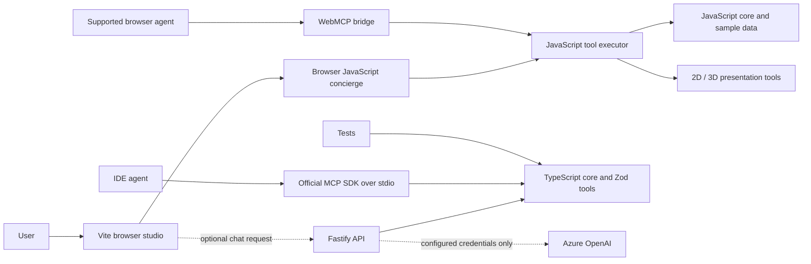
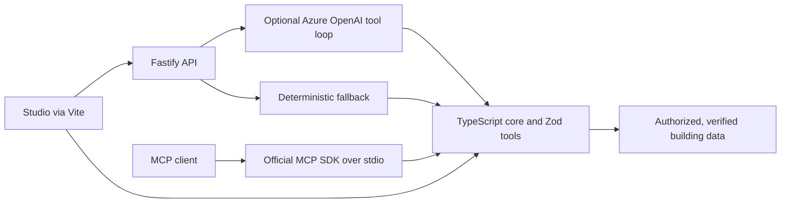

# Architecture and Migration Status

## Current Implementation
The browser studio is Vite-bundled HTML/CSS/ES modules under `src/web` and continues to use its JavaScript runtime, deterministic concierge, presentation tools, and optional WebMCP bridge. The stdio MCP server is a separate TypeScript workspace under `src/apps/mcp-server`; it uses the official SDK and the compiled TypeScript core, exposing headless tools over stdio. A Fastify API under `src/apps/api` offers a deterministic chat fallback and optional Azure OpenAI tool calling; the browser falls back to its local agent if the API is unavailable.

The strict TypeScript workspace at `src/packages/core` now contains geometry, the building model, search, wayfinding, validation, metrics, Zod tool schemas/executor, runtime, and the deterministic concierge. Unit tests exercise the compiled package. The browser still uses a parallel JavaScript implementation, so TypeScript is not yet the application's sole source of truth.

## Planned Architecture
The migration target keeps the studio interface while making the strict TypeScript core the shared source for browser and server callers. Zod v4 definitions remain the runtime validation and JSON-Schema source. The existing Fastify API already owns optional Azure OpenAI calls and server-side configuration, with a deterministic fallback; Vite already bundles the current UI and local Three.js dependencies. Production identity, approved data, hosting, and security review remain future work.

## Trust and Data Boundaries
- Tool calls are validated at the executor boundary and attributed to the caller.
- The MCP transport is local stdio today; no remote MCP endpoint is exposed.
- Azure configuration is optional and server-side. No secret belongs in this repository or browser bundle; neither the development API nor MCP stdio server has production authorization controls.
- The included building data is synthetic. Operational use requires authorized, verified plans and review by facilities/safety stakeholders.
- Emergency route output is a prototype indication only; follow official site procedures and signage.